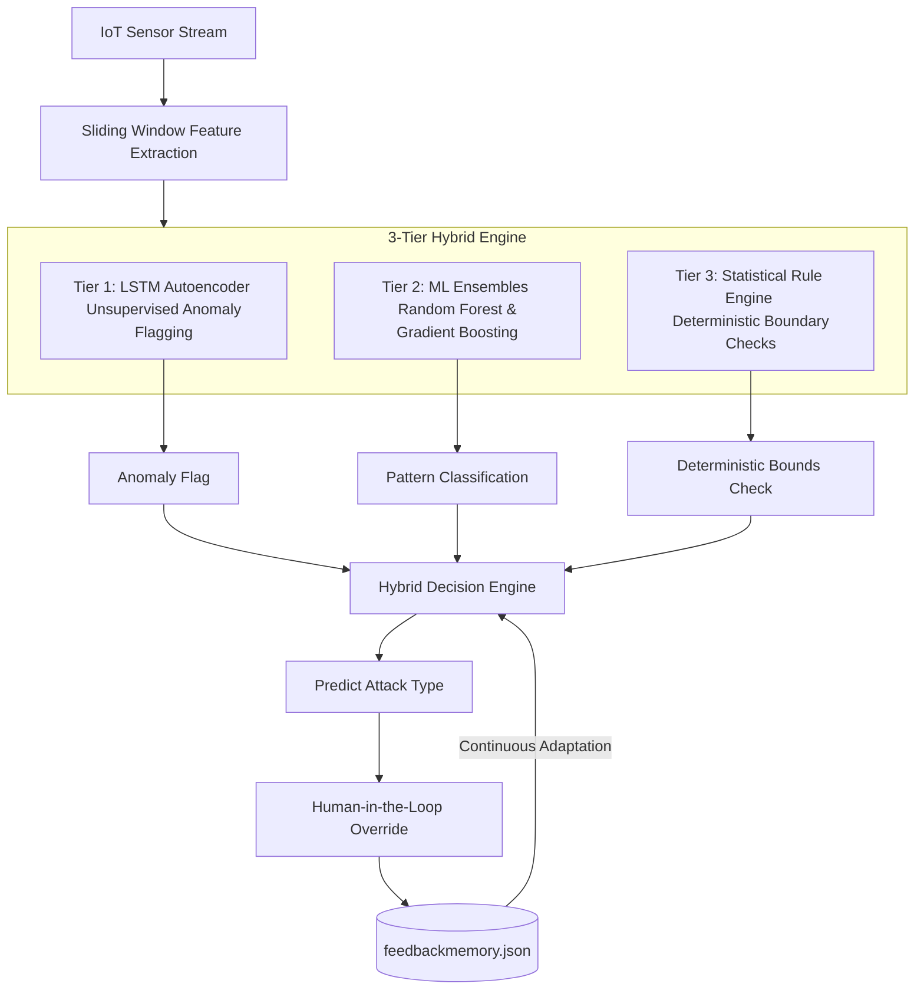

# 🏢 Resilient IoT Intrusion Detection System for Smart Buildings

A smart, real-time security system that protects smart buildings from hackers trying to tamper with temperature and humidity sensors (like the DHT11) to hijack heating and cooling systems. 

In this project, we performed an **ARP Spoofing attack** `[ARP Spoofing: An attack where a hacker links their computer to the network gateway to intercept and modify sensor readings]` to hijack and manipulate live sensor data. We then used this hijacked data to train our Machine Learning models, and we developed **Snort Rules** `[Snort Rules: Network security rules used to detect and drop malicious traffic packets]` to identify and block these spoofing attempts in real time.
<details>
<summary><b>🛡️ Enterprise Alignment & Relevance (BACnet/SC, ISA/IEC 62443, and Research Validation)</b></summary>

### 1. Enterprise Security Standards vs. Semantic Attacks
Today's modern building automation (Operational Technology, or OT) security relies on two primary layers:
*   **The Network Layer (BACnet Secure Connect - BACnet/SC):** Standardized under ASHRAE 135, it uses TLS 1.3 encryption and X.509 digital certificates to secure communications. **However, BACnet/SC only secures the "pipe."** If a sensor is physically tampered with (e.g., heating it with a lighter) or a gateway is compromised, BACnet/SC will happily encrypt and deliver the fake readings.
*   **The Compliance Layer (ISA/IEC 62443):** This global industrial standard mandates continuous behavioral monitoring and anomaly detection for control systems.

> [!IMPORTANT]
> **Our system acts as the "brain" looking inside the encrypted BACnet/SC pipe.** By analyzing data payloads at the application layer with our 3-tier hybrid engine, we detect **semantic anomalies** (fake drift, frozen drops, and data replays) that encryption cannot see. This directly satisfies the security logging and behavioral monitoring requirements of **ISA/IEC 62443-4-2**.

---

### 2. Academic & Industry Proof (Stored in `Resource/`)
Our hybrid approach and next-gen roadmap are validated by three recent research publications:

1.  **AI-Based Sensor Defense:** [Cybersecure Intelligent Sensor Framework for Smart Buildings (Sensors, Dec 2025)](Resource/Cybersecure_Intelligent_Sensor_Framework_Smart_Buildings.pdf)
    *   *Validates:* The industry standard of using hybrid ML (Random Forest/Ensembles) paired with rules to monitor sensor data integrity in smart buildings.
2.  **Physics-Informed Diagnostics:** [Physics-Informed LLMs/Models for HVAC Anomaly Detection (NeurIPS 2025 Workshop on UrbanAI)](Resource/Physics_Informed_LLM_HVAC_Anomaly_Detection.pdf)
    *   *Validates:* The integration of thermodynamic and physical boundary constraints to improve model transparency and drastically reduce false alarm rates.
3.  **Real-Time Adaptive Thresholds:** [Real-Time Adaptive Anomaly Detection in IIoT Environments (IEEE TNSM, 2024/2026)](Resource/RealTime_Adaptive_Anomaly_Detection_IIoT.pdf)
    *   *Validates:* The necessity of dynamic drift adaptation and continuous feedback loops to handle fluctuating sensor data streams.

</details>


## ⚡ Key Upgrades 
*   **78.10% Overall Accuracy** on multi-sensor streams.
*   **Interactive Web UI Dashboard** built with Streamlit and Plotly.
*   **Human-in-the-Loop Feedback Engine** for continuous adaptive learning.

---

## ⚠️ The Problem: Why Smart Buildings Need Proactive Security

As smart buildings automate climate control using IoT sensors, they introduce a critical vulnerability: the physical-digital overlap. If a hacker tampers with room temperature sensors, they can trick the central HVAC [Heating, Ventilation, and Air Conditioning] system into overheating or running continuously. This causes massive energy bills, physical equipment wear, and occupant discomfort.

While **enterprise cloud security solutions** exist, they are limited and slow. Uploading millions of sensor readings to the cloud creates latency `[delay]` and relies on constant internet connectivity. If the connection drops, the security drops. 

To solve this, our project implements a **real-time hybrid Intrusion Detection System (IDS)** that runs directly at the smart building edge `[Edge: Local processors in the building, rather than remote cloud servers]`. This provides low-latency, resilient protection that works even if the building loses internet access.

---

## 🛠️ Technical Rationale & Tech Stack

Our framework uses a lightweight, highly efficient stack optimized for real-time edge processing:

*   **Deep Learning (PyTorch):** We use an **LSTM Autoencoder** `[LSTM: Long Short-Term Memory model]` configured with `64 → 32` units. Unlike heavy Transformer models, LSTMs are lightweight and designed for sequential temporal data (time-series), establishing a normal behavioral baseline `[normal temperature profile]` of the building and flagging zero-day `[previously unseen]` attacks purely based on elevated reconstruction error.
*   **Machine Learning (Scikit-Learn):** Runs **Random Forest** and **Isolation Forest** classifiers in parallel to classify specific attack signatures when anomalies are flagged.
*   **Sensor Simulation (DHT11):** The DHT11 temperature and humidity sensor is the industry standard for climate control. We simulate DHT11 compromises because they model real-world attacks on HVAC systems, showing how fake readings can trigger physical utility failures.
*   **Web Dashboard (Streamlit & Plotly):** A lightweight dashboard for live visualization of sensor streams and detection flags.
*   **Data Pipeline (Pandas & Numpy):** Optimizes sliding temporal windows and feature extraction.
*   **Protocols (MQTT):** Supports asynchronous event-driven streaming from physical edge devices.

---

## ⚠️ Real-World Security Threat & Mitigation
In **December 2023 (Ireland)**, cyber attackers targeted European water utility infrastructure, accessing internal supervisory systems via exposed IoT gateways. By tampering with sensor streams, the attackers attempted to manipulate water levels, flow meters, and **chemical dosing values** to trigger physical utility failures. 

Traditional signature-based firewalls cannot detect these stealthy, low-and-slow manipulations. This project secures smart buildings against similar attacks in real time by continuously monitoring a **sliding window of sensor readings** (size = 30) and extracting key statistical features to block compromises at the edge:

*   **`temp_slope` (Trend):** Captures gradual shifts over time to block **Drift Attacks**.
*   **`temp_std` (Variance):** Differentiates between flat stuck values (**Drop Attacks**) and high-frequency fluctuations (**Noise Attacks**).
*   **`temp_range` (Spread):** Measures full peak-to-peak swings to identify **Injection Attacks**.
*   **`temp_entropy` (Shannon Entropy):** Detects elevated randomness and high-frequency noise profiles.
*   **`temp_max_jump` & `temp_spike`:** Identifies sudden absolute value deviations (spikes) indicative of malicious data injections.

---

## 🧠 3-Tier Defense Hybrid Architecture
No single detection technique is sufficient for advanced attacks. This system fuses three independent layers to achieve robust resilience:


### 🛡️ Tier Details:

1.  **Tier 1: Unsupervised LSTM Autoencoder (Anomaly Detection)**
    *   Trained exclusively on normal sensor data to establish a baseline of healthy building behavior.
    *   Compresses sequences (`LSTM 64 → LSTM 32`) and reconstructs them.
    *   Anomalies are flagged when the Mean Squared Error (MSE) reconstruction error exceeds a dynamic `3-sigma` threshold (`Mean + 3 * Std`).

2.  **Tier 2: Supervised ML Ensembles (Pattern Classification)**
    *   **Random Forest:** Acts as the primary pattern learner, mapping sequence features (slope, std, range, entropy, spikes, jumps) to attack classes.
    *   **Gradient Boosting (Currently Unused):** Trained during offline setup, but its predictions are currently bypassed in the final online decision chain. We plan to integrate it using a voting ensemble.
    *   **Isolation Forest:** Operates in parallel to flag novel, unseen anomaly distributions.

3.  **Tier 3: Deterministic Rule Engine (Edge Case Defense)**
    *   Runs alongside ML to catch clear physical limits.
    *   **Injection Attack Rule:** Triggered if `max_jump > 5.0°C` or `zscore_max > 5.0`.
    *   **Replay Attack Rule:** Compares the incoming data window to historical signatures in the buffer to catch repeated signals.
    *   **Drift Attack Rule:** Triggered when `abs(slope) > drift_threshold` (0.05).
    *   **Drop Attack Rule:** Triggered if `std < 0.1` and `range < 0.4` (freeze detection) or `slope < -0.15` (step drop).
    *   **Noise Attack Rule:** Triggered if `std > 2.0` and `entropy > 1.5`.

---

## 🔄 Human-in-the-Loop Continuous Learning Loop

To prevent AI hallucinations and adapt to seasonal building operations, the framework incorporates a **Continuous Feedback Learning Loop**:

1.  **System Prediction:** The model analyzes a sensor window and outputs a prediction (e.g., `Noise Attack | Confidence: Medium`).
2.  **User Review:** The administrator reviews the prediction via the Streamlit dashboard and overrides the label if it is a false positive.
3.  **Memory Storage:** Corrected feature vectors and their target labels are stored in `feedbackmemory.json`.
4.  **Instant Matching:** For subsequent inferences, the classification engine checks the feedback database for similar historical patterns, bypassing model errors and automatically correcting similar alerts in the future.

---

## 📊 Performance Evaluation Matrix

Validation results comparing the system before and after our patches:

| Metric |Current Baseline|
| :--- | :---: |
| **Overall Accuracy** | **78.10%** |
| **Normal Recall** | **90.16%** (Precision: 94.03%) |
| **Noise Attack Recall** | **93.85%** (Precision: 64.21%) |
| **Drift Attack Recall** | **43.80%** (Precision: 55.21%) |
| **Replay Attack Recall** | **3.33%** (Precision: 100.00%) |
| **Drop Attack Recall** | **13.41%** (Precision: 100.00%) |

---

## 🚀 Solution Roadmap: 

To bridge the remaining detection gaps and transition this prototype into a commercial-grade, rock-solid smart building security product, we are launching an aggressive technical upgrade roadmap divided into three core pillars:
### ⚡ A. Hardware & Edge Optimization
*   **MCU Deployment [ESP32 / ARM Cortex-M]:** We are quantizing `[shrinking model size and math precision]` our PyTorch LSTM models so they can run directly on low-power, $5 microcontrollers inside wall-mounted thermostat sensors.
*   **ONNX Gateway Acceleration:** Deploying on edge gateway boxes (like Raspberry Pi 5 or NVIDIA Jetson Orin Nano). Exporting models to ONNX Runtime enables sub-millisecond hardware-accelerated predictions for thousands of rooms simultaneously.
*   **C++/Rust Feature Engineering:** Rewriting the sliding-window feature calculations in C++ or Rust as a Python extension, dropping latency from milliseconds to microseconds.

### 📊 B. Enterprise Data Fusion & Streaming
*   **Multi-Modal Sensor Fusion:** Temperature alone is easy to spoof. We are integrating CO2, air quality (VOCs), motion detectors (PIR), and HVAC power logs. If temperature spikes but the room is empty and the heater is off, the system automatically shuts down the spoofed stream.
*   **Event-Driven MQTT Streams:** Moving from static file evaluation to a live, asynchronous `[irregularly timed]` sensor queue using MQTT and Apache Kafka to handle live building telemetry.
*   **Physics-Informed Thermal Modeling:** Connecting our dataset generator to building energy simulators like EnergyPlus to generate highly realistic normal baselines that factor in sunlight, windows, and insulation.

### 🤖 C. Advanced AI & Architecture Upgrades
*   **Constant-Time Replay Search via LSH:** Instead of a limited sliding 100-window history, we are implementing Locality-Sensitive Hashing (LSH). LSH converts window waves into short signatures, allowing the detector to query a database of 10,000+ past windows in constant $O(1)$ time to catch replays from days ago instantly.
*   **Seasonal & Diurnal Adaptive Baselines:** Temperature baselines naturally drift between day and night, and summer and winter. We are deploying an online adaptive baseline threshold that self-adjusts based on weather forecasts and time-of-day.
*   **Temporal Convolutional Networks (TCNs):** Upgrading from recurrent LSTM models to 1D Temporal CNNs with dilated convolutions. CNNs process time-series windows in parallel, dramatically speeding up training and edge inference.
  
## 📂 Project Structure

```text
Preventing-Wrong-Decisions-in-Smart-Building-Systems/
├── README.md                                                 # Project Documentation
├── SECURITY.md                                               # Security reporting guidelines
│
├── Preventing-Wrong-Decisions-in-Smart-Building-Systems-IBM/ # 🚀 Patched Production Codebase
│   ├── app.py                                                # Streamlit UI monitor dashboard
│   ├── hybrid_iot_ids.py                                     # Core decision engine
│   ├── feedback_engine.py                                    # Feedback database manager
│   ├── run_hybrid_demo.py                                    # Automated demo pipeline
│   ├── test_hybrid_iot_ids.py                                # Unit test suite
│   ├── enhanced_iot_dataset_3sensors.csv                     # Multi-sensor active dataset
│   ├── feedbackmemory.json                                   # Pre-seeded feedback overrides
│   ├── IMPLEMENTATION_SUMMARY.md                             # Enhanced metrics summary
│   ├── detection/                                            # Replay and config submodules
│   ├── features/                                             # Feature extraction submodules
│   └── DataSet Gen/                                          # Dataset generator scripts
│
├── Aman_cybersecurity/                                       # Aman's original security scripts
│   ├── detect.py                                             # Original rules script
│   ├── attacks.py                                            # Original attacks simulator
│   └── cyber_output.pages                                    # Research documentation
│
├── database/                                                 # Raw datasets & logs
│   ├── dht11_dataset_10000.csv                               # Original 10k single-sensor dataset
│   └── log_temp.csv                                          # Temperature log data
│
└── archive/                                                  # Archived exploratory work
    └── dht11-anomaly-detection-lstm-ae-replay-attack.ipynb   # Jupyter notebook


``` 
# 🚀 Getting Started

## 📋 Prerequisites

> **Recommended:** Python **3.13 (Stable Release)**

> [!NOTE]
> Python **3.13** is recommended for maximum compatibility.
>
> Newer pre-release versions (such as **Python 3.14**) may not yet have stable builds of **TensorFlow** or **PyTorch** available for Windows.

---

## 1️⃣ Install Dependencies

```bash
pip install pandas numpy scikit-learn tensorflow streamlit plotly matplotlib
```

Alternatively, if a `requirements.txt` file is available:

```bash
pip install -r requirements.txt
```

---

## 2️⃣ Navigate to the Project Directory

```bash
cd Preventing-Wrong-Decisions-in-Smart-Building-Systems-IBM
```

---

## 3️⃣ Launch the Interactive Dashboard

Start the Streamlit web application:

```bash
streamlit run app.py
```

After execution, open your browser and visit:

```text
http://localhost:8501
```

---

## 4️⃣ Run the Hybrid Simulation Demo

Execute the automated demonstration pipeline:

```bash
python run_hybrid_demo.py
```

---

## 5️⃣ Execute Unit Tests

Run the complete test suite to verify functionality:

```bash
python -m unittest test_hybrid_iot_ids.py
```

---

## 🛠 Technology Stack

| Component        | Technology         |
| ---------------- | ------------------ |
| Language         | Python 3.13        |
| Dashboard        | Streamlit          |
| Machine Learning | TensorFlow         |
| Data Processing  | Pandas, NumPy      |
| Visualization    | Plotly, Matplotlib |
| Testing          | unittest           |
| Algorithms       | Scikit-learn       |

---

## ✅ Expected Workflow

```text
Install Dependencies
        ↓
Launch Dashboard
        ↓
Run Hybrid Demo
        ↓
Execute Tests
        ↓
Analyze Results
```
