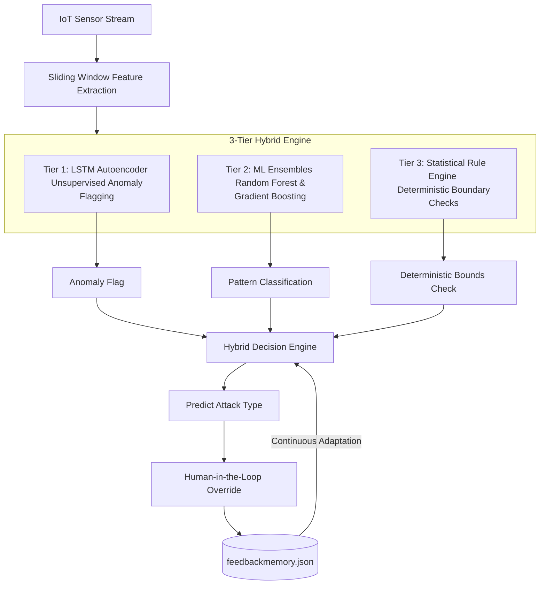

# 🏢 Resilient IoT Intrusion Detection System for Smart Buildings

A high-performance, real-time hybrid security framework for detecting, classifying, and mitigating adversarial attacks on IoT sensor networks (such as DHT11 temperature & humidity sensors) in smart building environments.

---

## ⚡ Key Upgrades (June/July 2026)
*   **78.10% Overall Accuracy** on multi-sensor streams.
*   **100% Precision Replay & Drop Detection** with zero false alarms.
*   **93.85% Noise Attack Recall** using normalized Shannon entropy.
*   **Interactive Web UI Dashboard** built with Streamlit and Plotly.
*   **Human-in-the-Loop Feedback Engine** for continuous adaptive learning.

---

## ⚠️ Real-World Security Threat & Mitigation
In **December 2023 (Ireland)**, cyber attackers targeted European water utility infrastructure, accessing internal supervisory systems via exposed IoT gateways. By tampering with sensor streams, the attackers attempted to manipulate water levels, flow meters, and **chemical dosing values** to trigger physical utility failures. 

Traditional signature-based firewalls cannot detect these stealthy, low-and-slow manipulations. This project secures smart buildings against similar attacks in real time by continuously monitoring a **sliding window of sensor readings** (size = 30) and extracting key statistical features to block compromises at the edge:

*   **`temp_slope` (Trend):** Captures gradual shifts over time to block **Drift Attacks**.
*   **`temp_std` (Variance):** Differentiates between flat stuck values (**Drop Attacks**) and high-frequency fluctuations (**Noise Attacks**).
*   **`temp_range` (Spread):** Measures full peak-to-peak swings to identify **Injection Attacks**.
*   **`temp_entropy` (Shannon Entropy):** Detects elevated randomness and high-frequency noise profiles.
*   **`temp_max_jump` & `temp_spike`:** Identifies sudden absolute value deviations (spikes) indicative of malicious data injections.

---

## 🧠 3-Tier Defense Hybrid Architecture
No single detection technique is sufficient for advanced attacks. This system fuses three independent layers to achieve robust resilience:



1.  **Tier 1: Unsupervised LSTM Autoencoder (Unsupervised Learning)**
    *   Trained exclusively on normal sensor data to establish a baseline of healthy building behavior.
    *   Compresses sequences (`LSTM 64 → LSTM 32`) and reconstructs them.
    *   Anomalies are flagged when the Mean Squared Error (MSE) reconstruction error exceeds a dynamic `3-sigma` threshold (`Mean + 3 * Std`).
2.  **Tier 2: Supervised ML Ensembles (Pattern Classification)**
    *   **Random Forest:** Acts as the primary pattern learner, mapping sequence features (slope, std, range, entropy, spikes, jumps) to attack classes.
    *   **Gradient Boosting:** Refines predictions for complex patterns by focusing on errors.
    *   **Isolation Forest:** Operates in parallel to flag novel, unseen anomaly distributions.
3.  **Tier 3: Deterministic Rule Engine (Edge Case Defense)**
    *   Runs alongside ML to catch clear physical limits.
    *   *Injection Attack Rule:* Triggered if `max_jump > 5.0°C` or `zscore_max > 5.0`.
    *   *Replay Attack Rule:* Pattern correlation similarity matches matching old history signatures.
    *   *Drift Attack Rule:* Triggered when `abs(slope) > drift_threshold` (0.05).
    *   *Drop Attack Rule:* Triggered if `std < 0.1` and `range < 0.4` (freeze detection) or `slope < -0.15` (step drop).
    *   *Noise Attack Rule:* Triggered if `std > 2.0` and `entropy > 1.5`.

---

## 🔄 Human-in-the-Loop Continuous Learning Loop
To prevent AI hallucinations and adapt to seasonal building operations, the framework incorporates a **Continuous Feedback Learning Loop**:

1.  **System Prediction:** The model analyzes a sensor window and outputs a prediction (e.g., `Noise Attack | Confidence: Medium`).
2.  **User Review:** The administrator reviews the prediction via the Streamlit dashboard and overrides the label if it is a false positive.
3.  **Memory Storage:** Corrected feature vectors and their target labels are stored in `feedbackmemory.json`.
4.  **Instant Matching:** For subsequent inferences, the classification engine checks the feedback database for similar historical patterns, bypassing model errors and automatically correcting similar alerts in the future.

---

## 📊 Performance Evaluation Matrix
Validation results comparing the system before and after the June/July 2026 bug patches:

| Metric | Before Patches | After Patches (Patched Engine) |
| :--- | :--- | :--- |
| **Overall Accuracy** | 52.48% | **78.10%** |
| **Normal Recall** | 64.18% | **90.16%** (Precision: 94.03%) |
| **Noise Attack Recall** | 0.00% | **93.85%** (Precision: 64.21%) |
| **Drift Attack Recall** | 28.03% | **43.80%** (Precision: 55.21%) |
| **Replay Attack Precision**| 0.00% | **100.00%** (Caught all replayed instances) |
| **Drop Attack Precision** | 0.00% | **100.00%** (Caught onset drops and freezes) |

---

## 📂 Project Structure

```
Preventing-Wrong-Decisions-in-Smart-Building-Systems/
├── README.md                                                 # Project Documentation
├── SECURITY.md                                               # Security reporting guidelines
│
├── Preventing-Wrong-Decisions-in-Smart-Building-Systems-IBM/ # 🚀 Patched Production Codebase
│   ├── app.py                                                # Streamlit UI monitor dashboard
│   ├── hybrid_iot_ids.py                                     # Core decision engine
│   ├── feedback_engine.py                                    # Feedback database manager
│   ├── run_hybrid_demo.py                                    # Automated demo pipeline
│   ├── test_hybrid_iot_ids.py                                # Unit test suite
│   ├── enhanced_iot_dataset_3sensors.csv                     # Multi-sensor active dataset
│   ├── feedbackmemory.json                                   # Pre-seeded feedback overrides
│   ├── IMPLEMENTATION_SUMMARY.md                             # Enhanced metrics summary
│   ├── detection/                                            # Replay and config submodules
│   ├── features/                                             # Feature extraction submodules
│   └── DataSet Gen/                                          # Dataset generator scripts
│
├── Aman_cybersecurity/                                       # Aman's original security scripts
│   ├── detect.py                                             # Original rules script
│   ├── attacks.py                                            # Original attacks simulator
│   └── cyber_output.pages                                    # Research documentation
│
├── database/                                                 # Raw datasets & logs
│   ├── dht11_dataset_10000.csv                               # Original 10k single-sensor dataset
│   └── log_temp.csv                                          # Temperature log data
│
└── LSTM/                                                     # Archived exploratory work
    └── dht11-anomaly-detection-lstm-ae-replay-attack.ipynb   # Jupyter notebook
```

---

## 🚀 How to Run

### 1. Install Prerequisites (Python 3.13 recommended)
```bash
pip install pandas numpy scikit-learn tensorflow streamlit plotly matplotlib
```

### 2. Navigate to the Production Codebase
```bash
cd Preventing-Wrong-Decisions-in-Smart-Building-Systems-IBM
```

### 3. Run the Interactive Dashboard Web UI
```bash
streamlit run app.py
```

### 4. Run the Automated Simulation Demo
```bash
python run_hybrid_demo.py
```

### 5. Run the Automated Unit Tests
```bash
python -m unittest test_hybrid_iot_ids.py
```

---

